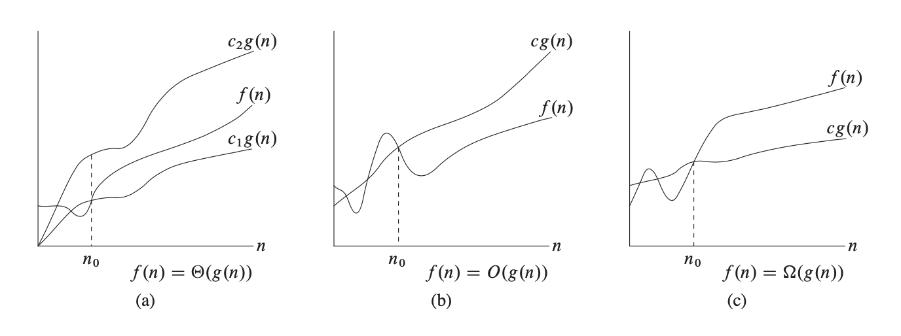
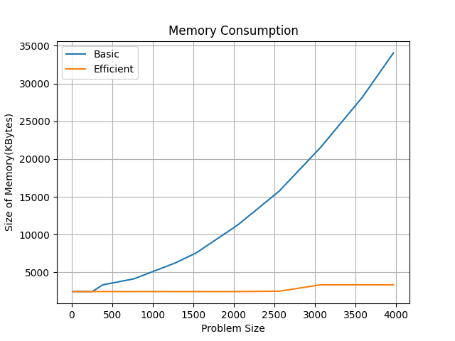
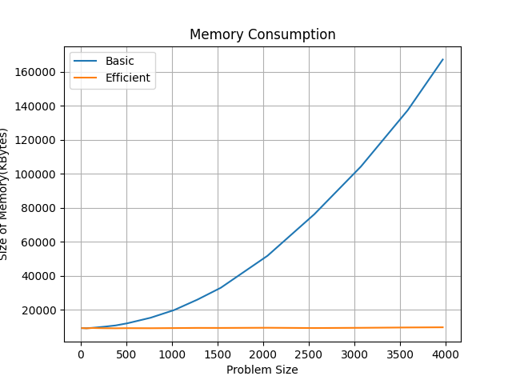
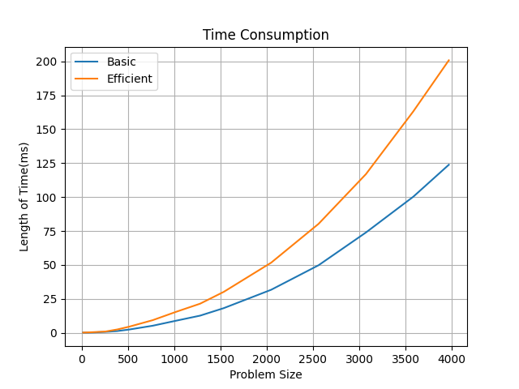
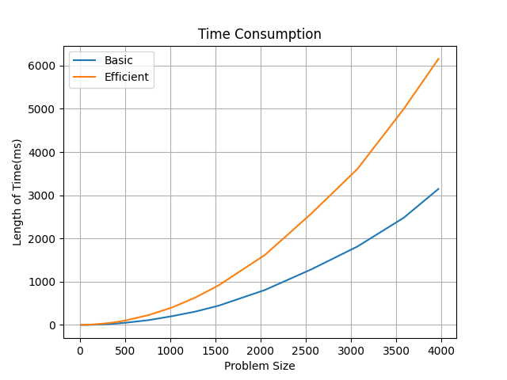
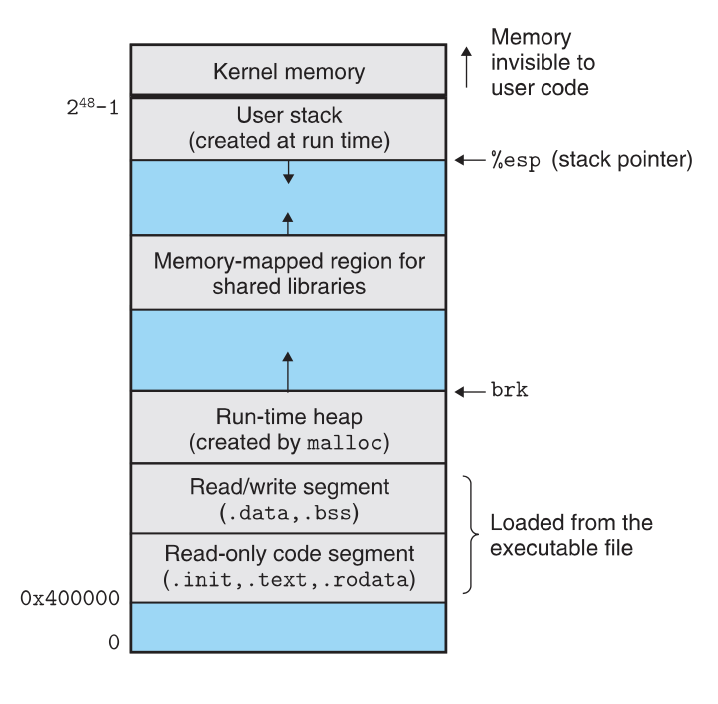

# Lab1
Of course I will help you guys with these four problems listed in the lab webpage. 

But I want to let you know some more about computer science and I don't like the class with just me talking, so I will invite some of you, who are interested in programming, to talk about the engineering experience you have with your major. 

# Folder Structure
Files: 
* README: just read it
* `*.cpp`: source code of the class
* `factorial.py`: give the right factorials of any size
* `random_number.txt`: random numbers used by means.cpp
* `factorial.s`: assembly file for the factorial_trivial.cpp
* `*.png`: images used in README

```shell
.
├── README.md
├── factorial_final.cpp
├── factorial_trivial.cpp
├── means.cpp
├── play.cpp
├── quadratic_root.cpp
├── summation.cpp
├── factorial_trivial.s
├── factorial.py
├── random_number.txt
├── 2022-05-26-11-20-20.png
├── 2022-05-26-11-45-34.png
├── 2022-05-26-11-46-06.png
├── 2022-05-26-11-46-22.png
├── 2022-05-26-11-46-40.png
└── 2022-05-26-21-20-50.png
```

# Problems
## Q1 Factorials
> Different Implementation in Different languages: http://rosettacode.org/wiki/Factorial#C

Recursive Definition: 

$n! = n * (n - 1)!$ and  $0! = 1$ according to the convention for an empty product.

Program factorial in 
* recursion 
* ~~non-recursion way~~

And try out the 13! with your function and check it, `1932053504`, with the correct answer `6227020800`

Why this happens?

It is because all types in C/C++ are limited to some size, e.g. 4 bytes for int. 

---

How to know what is going wrong? 

I recommend you to use debugger instead of printing to get the temporary value by executing the whole program. 
> Because you need to wait for it until the end of the execution and it becomes a bigger problem when it prints too much. 

---

Illustration of debugger in lab with LLDB
> I used LLDB in lab because it is hard to get GDB to work in macOS, and I recommend you to use GDB if you are using Linux
> The idea between LLDB and GDB are the same, so just follow LEARN one of them anyway
> https://cs61.seas.harvard.edu/site/ref/gdb/

* get debug information, e.g. symbol table, when compiling
* list source code
    * list function and file
* run
* step
    * step in (s): go to next line of source code and go into the function if the current line is function
    * step over (n): go to next line of source code and execution the whole function if the current line is function
    ~~* step in instruction (si): go to next line of instruction (assembly)~~ Not useful if you are not debugging from the instruction level
* breakpoint in code: inspecting in execution
* continue
* print
* display: constantly print some **expression** not variable
* (Advanced) traceback of stack
    * display stack
    * frame and frame select

What to do to avoid this? 
NO NEED TO avoid it, it is YOUR responsibility to handle it!!!
> Why not just Python!!! I love it!!! Even though I know I have the ability to program it with C++!!!

Solution: Checking the multiplication overflow!
> https://www.tutorialspoint.com/check-for-integer-overflow-on-multiplication-in-cplusplus

Just one easy equation: $(a*b)/b == a$

---

Let there be overflow, and there was overflow!

We have this in the final version to throw abort in code. 

## Q2 Different Means
Just follow the definition!!!

Formulas:
* Arithmetic Mean: 
    * $$\frac{1}{n}*\sum_{i = 1}^{n}a_i$$ 
    * domain for $$A = {a_1, ..., a_n}$$ and $a_i \in R$
    * http://www.alcula.com/calculators/statistics/mean/
* Geometric Mean: 
    * formula: $$(\prod_{i = 1}^{n}x_i)^{\frac{1}{n}}$$ 
    * domain: for $$X = {x_1, ..., x_n}$$ and $x_i \in R^+$
    * http://www.alcula.com/calculators/statistics/geometric-mean/
* Harmonic Mean: 
    * formula: $$H={\frac {n}{{\frac {1}{x_{1}}}+\cdots+{\frac {1}{x_{n}}}}}={\frac {n}{\sum \limits _{i=1}^{n}{\frac {1}{x_{i}}}}}=\left({\frac {\sum \limits _{i=1}^{n}x_{i}^{-1}}{n}}\right)^{-1}$$ 
    * domain for $$X = {x_1, ..., x_n}$$ and $x_i \in R$
    * **relationship** between HM and AM: HA is the reciprocal of (AM of the reciprocals)
    * http://www.alcula.com/calculators/statistics/harmonic-mean/

Here comes the question: why we program? how should we program?
* To implement our thought
* With plan by scheduling what to do!
* of course, make smaller plan for the new problems!

## Q3 Quadratic Root
For quadratic equation, $a*x^2 + b*x + c = 0$ and $criteria = b^2 - 4*a*c$. 

Criteria of the existance of roots:
* criteria > 0: 2 roots exist
* criteria = 0: 1 root exists
* criteria < 0: no root exists

The root will be $root = \frac{-b \pm \sqrt{c}}{2*a}$ if criteria >= 0

## Q4 Summation
For input n, get the summation of S = {1, 2, ..., n}
* Equation: $\frac{(1 + n)*n} {2}$
* Looping: just while


What is difference between these two methods? 

Complexity!!!


* $\theta$ Notation (Asymptotic Tight Bound): $\theta(g(n))$ = {f(n):there exist positive constants c1, c2, and $n_0$, s.t. $0 \le c1*g(n) \le f(n) \le c2*g(n), \forall n \gt n_0$}
* Big-O Notation (Asymptotic Upper Bound): O(g(n)) = {f(n):there exist positive constants c and $n_0$, s.t. $f(n) \le c*g(n), \forall n \gt n_0$}
* $\Omega$ Notation (Asymptotic Lower Bound): $\Omega$(g(n)) = {f(n):there exist positive constants c and $n_0$, s.t. $c*g(n)\le f(n) , \forall n \gt n_0$}

So for our algorithm: 
* Equation: just mathematical calculation
* Looping: $\theta(n)$ for the length of input is n

# Extra

## For Q1
For factorial_trivial, it is very easy to understand why it output `1932053504`

Illstration of the correctness of C++'s calculation: 
```python
t = 479001600 * 13
m = (0x1<<31) -1 # excluding MSB and get the lower 31 bits
t & m
```

## For Q4
So why don't we use Python? 
Data structure and algorithm!!!

Comparison between C++ and Python in the same algorithm!
> Correctness of both implementation is checked positive by a course score

Memory Consumption: 

C++



---

Python



---

Time Consumption: 

C++



---

Python



Note: They are implemented by different people, so the slope of the curve is a little bit different. 

## Memory Layout of Running Process
Note that in lab we have lower address on the top and higher address at the bottom. 



You may soon encounter the segment fault soon, check if you have
* access wrong memory when using point
* too much level of recursion

It will be a segment fault when you do this: 
```shell
$ ./factorial_final
123456789
[1]    10529 segmentation fault  ./factorial_final

---

* thread #1, queue = 'com.apple.main-thread', stop reason = signal SIGABRT
  * frame #0: 0x00007ff81916400e libsystem_kernel.dylib`__pthread_kill + 10
    frame #1: 0x00007ff81919a1ff libsystem_pthread.dylib`pthread_kill + 263
    frame #2: 0x00007ff8190e5d24 libsystem_c.dylib`abort + 123
    frame #3: 0x0000000100003e29 factorial_final`factorial_recursion(n=13) at factorial_final.cpp:19:9
    ...
    frame #113: 0x0000000100003dfc factorial_final`factorial_recursion(n=123) at factorial_final.cpp:15:16
    frame #114: 0x0000000100003ef9 factorial_final`main at factorial_final.cpp:46:19
    frame #115: 0x000000010001551e dyld`start + 462
```


# Key Takeaway
* Use debugger to locate the errors during the running process
* Relationship between mathematics and programming: 
    * mathematics: abstraction (and sometimes generalization) of problem
    * programming: procedural implementation with the help of math
* Program = Algorithm + Data Structure
    * Programming languages are just different types of expression

# References
* Introduction to Algorithms, 978-0262033848
* Computer Systems: A Programmer's Perspective, 3/E (CS:APP3e), 978-0134092669

